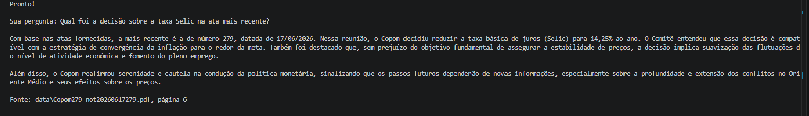
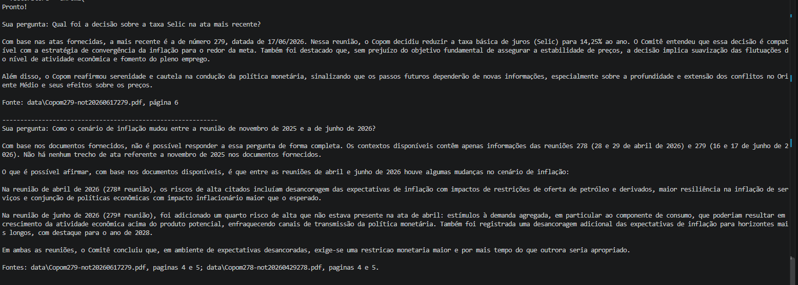
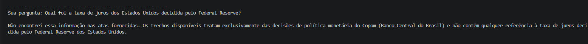

# Sistema RAG - Consulta a Atas do Copom

Sistema de Retrieval Augmented Generation (RAG) que permite fazer perguntas em linguagem natural sobre as Atas do Comitê de Política Monetária (Copom) do Banco Central do Brasil, com respostas ancoradas nos documentos originais e citação de fonte.

## Por que este projeto

Como parte da minha transição para AI Engineering, queria entender RAG na prática, além da teoria. Escolhi as Atas do Copom como domínio porque tenho interesse real em investimentos (FIIs e ações), e decisões de política monetária (Selic) impactam diretamente esses ativos — então construí uma ferramenta que eu mesmo uso para consultar decisões históricas rapidamente.

## Como funciona (pipeline)
PDFs (Atas do Copom)
    ↓ loader.py — extrai texto, filtra páginas sem conteúdo útil (capas)
    ↓ splitter.py — divide em chunks de ~1000 caracteres com overlap
    ↓ indexer.py — gera embeddings e persiste no ChromaDB
    ↓ retriever.py — busca semântica dos chunks mais relevantes por pergunta
    ↓ generator.py — monta prompt com contexto + pergunta, gera resposta via Claude
    ↓ main.py — loop interativo via terminal

    ## Stack técnica

- **LangChain** — orquestração do pipeline
- **ChromaDB** — banco vetorial
- **sentence-transformers** (`paraphrase-multilingual-MiniLM-L12-v2`) — embeddings locais, gratuitos, multilíngues
- **Anthropic API (Claude)** — geração da resposta final
- **Pandas** — diagnóstico e validação da qualidade dos dados extraídos
- **pypdf** — extração de texto de PDF

## Decisões técnicas e por quê

**Embeddings locais em vez de API paga (Voyage AI/OpenAI):** a Anthropic não oferece endpoint de embeddings nativo. Para um projeto de portfólio/aprendizado, optei por um modelo local gratuito em vez de adicionar mais uma dependência de API paga.

**Modelo de embedding multilíngue:** o modelo mais popular de embeddings leves (`all-MiniLM-L6-v2`) é majoritariamente treinado em inglês. Como o domínio é 100% português, usei a variante multilíngue (`paraphrase-multilingual-MiniLM-L12-v2`) para melhor qualidade de busca semântica.

**Filtro de páginas por tamanho de conteúdo:** validei com Pandas que a página de capa de cada ata tinha ~180 caracteres, contra 2.900+ das páginas de conteúdo real — um filtro de 200 caracteres remove capas sem perder informação relevante (29 páginas úteis de 35 totais).

**Chunk size de 1000 caracteres com overlap de 150:** equilíbrio entre contexto suficiente por chunk e granularidade para não misturar assuntos diferentes num único chunk recuperado.

**Prompt de sistema restritivo:** instruí o Claude a responder exclusivamente com base no contexto recuperado, e a admitir quando a informação não está presente — evitando que o modelo complete lacunas com conhecimento geral (alucinação).

## Como rodar

```bash
git clone https://github.com/ArthurSanches-ds/rag-copom-langchain.git
cd rag-copom-langchain

python -m venv venv
venv\Scripts\activate

pip install -r requirements.txt

# Baixe as Atas do Copom em https://www.bcb.gov.br/publicacoes/atascopom
# e salve os PDFs na pasta data/

# Cria um arquivo .env na raiz com:
# ANTHROPIC_API_KEY=sua_chave_aqui

python src/indexer.py    # gera o índice vetorial (rodar uma vez)
python src/main.py       # inicia o sistema interativo
```

## Exemplos de uso

### Pergunta direta sobre decisão de política monetária


### Pergunta que exige comparação entre documentos diferentes


### Pergunta fora do escopo do conteúdo (validando que o sistema não alucina)


## O que aprendi construindo este projeto

- **RAG na prática vai muito além de "juntar LangChain com ChromaDB"**: entender chunking, overlap e escolha de modelo de embedding fazem diferença real na qualidade do retrieval — testei isso comparando resultados, não só copiei parâmetros de tutorial.
- **Validação de dados antes de indexar é essencial**: usar Pandas para inspecionar tamanho de conteúdo por página revelou que páginas de capa estavam poluindo o índice, e a decisão de filtro foi baseada em dado real, não em suposição.
- **A escolha do modelo de embedding importa mais do que parece**: usar um modelo treinado majoritariamente em inglês para indexar conteúdo em português teria comprometido a qualidade da busca silenciosamente — sem erro, só com resultados piores.
- **Debugging de ambiente é parte do trabalho real**: enfrentei desde erros de path/pasta duplicada, `requirements.txt` corrompido com dependências de outra ferramenta, erro de memória por disco cheio, até um erro de autenticação causado por um `.env` mal editado (texto de exemplo não apagado). Resolver cada um metodicamente — isolando a causa antes de tentar soluções — foi tão parte do aprendizado quanto escrever o pipeline em si.
- **Prompt engineering para evitar alucinação é uma decisão de design, não um detalhe**: sem instrução explícita para o modelo se limitar ao contexto fornecido, o sistema poderia misturar informação real das atas com conhecimento geral do modelo, comprometendo a confiabilidade da ferramenta.

## Limitações conhecidas (próximos passos possíveis)

- Perguntas ambíguas ou mal formuladas podem recuperar chunks menos relevantes (retrieval básico por similaridade, sem reranking)
- Não há avaliação automatizada de qualidade do retrieval (métricas de precisão/recall)
- Extração de PDF mantém pequenos resíduos de cabeçalho/rodapé (ex: número de página, domínio do site) que não comprometem a busca, mas poderiam ser limpos com pós-processamento adicional

## Autor

Arthur Sanches — [github.com/ArthurSanches-ds](https://github.com/ArthurSanches-ds)